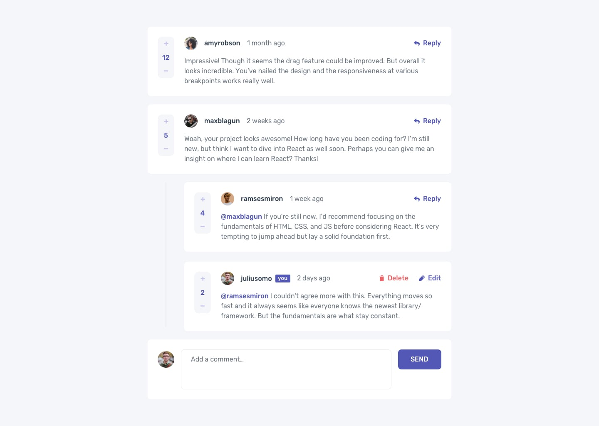

# Comments App

## Proyecto de practica para probar nuevas librerias

Proyecto obtenido de frontmento.io
[Link al proyecto](<[URL](https://www.frontendmentor.io/challenges/interactive-comments-section-iG1RugEG9)>)


## Setup

Install the dependencies:

```bash
npm install
```

Create .env file

```bash
PUBLIC_SERVER_BASE_PATH=
```

## Get Started

Start the dev server:

```bash
npm devel
```

## Librerias

```bash
    "@tanstack/react-query": Libreria para manejar peticiones HTTP,
    "axios": Libreria para facilitar los peticiones HTTP,
    "class-variance-authority": Libreria que ayuda a tener multiples variantes de un componente en un objeto, se ocupa con tailwind,
    "clsx": Libreria que ayuda a juntar clases basados en condicionales, va de la mano con tailwind,
    "date-fns": Libreria para manejar fechas internacionalmente,
    "react": Libreria Frontend,
    "react-dom": Libreria para hacer el cruce del archivo root del HTML,
    "sonner": Libreria de toast minimalista,
    "sweetalert2": Libreria para modales,
    "tailwind-merge": Libreria que ayuda a juntar clases de tailwind,
    "wouter": Libreria de routeo minimalista
```
